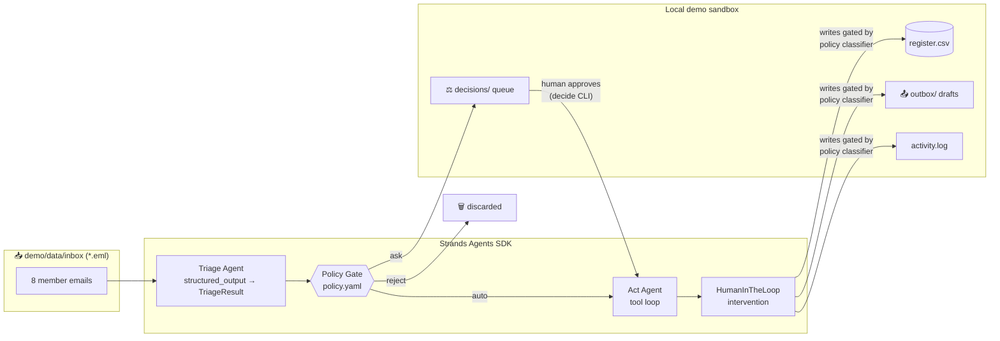

# ClubKeeper

**The club-secretary agent that runs your volunteer club's inbox overnight — and only wakes you for decisions that deserve a human.**

Entry for the [Agents for Humans Hackathon](https://agentsforhumans.devpost.com/) (AWS × Devpost, 2026) · Track: **Good Neighbor Agents**
Built with the [Strands Agents SDK](https://strandsagents.com/), powered by GLM (Z.ai) via LiteLLM.

---

## The problem

Community sports clubs, PTAs, scout troops and neighborhood leagues run on a handful of
burned-out volunteers. The club secretary spends hours every week on member emails:
sign-ups, address changes, cancellations, fee questions, hardship requests. Almost all of
it is repetitive — but some of it (a single parent asking for a fee waiver) deserves real
human warmth and judgment.

## What ClubKeeper does

Overnight, unattended:

1. **Triages** every mail in the club inbox (structured extraction, no guessing)
2. **Updates the member register** (CSV) — new members, address/email changes, team moves
3. **Drafts warm, on-brand replies** into the outbox (nothing is ever sent automatically)
4. **Queues only real judgment calls** for the secretary: hardship waivers, mid-season
   cancellations, complaints
5. **Discards spam** silently
6. **Logs every action** with its reasoning (full audit trail)

The secretary's morning: an empty inbox, an updated register, 8 polished drafts —
and 2–3 decision cards that take seconds each.

## The policy is data, not code

The club's rules live in [`demo/corpus/policy.yaml`](demo/corpus/policy.yaml):

```yaml
rules:
  - intent: signup            # complete signups are routine
    decision: auto
  - intent: hardship_waiver   # money + empathy = human decides
    decision: ask
  - intent: spam
    decision: reject
```

Volunteers edit YAML, not Python. And this file isn't just documentation — it literally
*is* the runtime classifier of the SDK's Human-in-the-Loop intervention (see below).

## Architecture



**Human-in-the-loop, the Strands way:** the Act agent runs with the SDK's
[`HumanInTheLoop`](https://strandsagents.com/docs/user-guide/concepts/agents/interventions/human-in-the-loop/)
intervention. Our custom classifier reads the case context (intent + autonomy) from the
agent state and the club's policy: read-only tools always run free, writes run free only
when the policy says `auto` or a human has approved the case — otherwise the tool call
is escalated. Fail-closed for unknown tools.

**Member memory:** each member gets a persistent agent session
(`FileSessionManager`, `demo/data/sessions/`). When Kwame's mother writes again a week
later, the agent remembers the instalment plan it proposed and answers consistently —
try mail 09 in the corpus.

**Run transparency:** every run writes `demo/data/run_summary.json` — mails, routes,
tokens, latency, tool calls per step, and a cost estimate (~€0.01–0.03 per night for a
small club on GLM-class models). Volunteers can see exactly what the agent did, how long
it took, and what it cost.

## Quickstart

```bash
git clone <repo-url> && cd clubkeeper
uv sync
cp .env.example .env          # add your Z.ai API key (https://z.ai)
export $(grep -v '^#' .env | xargs)

# 1. nightly batch run (the "overnight" part)
uv run python scripts/reset_demo.py     # pristine demo inbox: 8 mails
uv run python -m clubkeeper.pipeline

# 2. the human part — work the decision queue
uv run python -m clubkeeper.decide      # approve / edit / deny per case
```

Results appear in `demo/data/`: `outbox/` (drafts), `register.csv` (updated),
`decisions/` (cleared), `activity.log` (audit trail).

No cloud, no accounts, no network beyond the LLM API call. Everything else is local files.

## Decisions the agent asks about (examples from the demo corpus)

| Mail | Intent | Why it needs a human |
|---|---|---|
| "Hard times — can the fee be waived?" (single mother, reduced hours) | hardship_waiver | Money + empathy — policy says always ask |
| "Cancelling Noah's membership" (mid-season, fees paid) | cancellation | Team planning + refund judgment |
| "Third cancelled training in a row!" (angry neighbour) | complaint | Conflicts need a human touch |

And things it never asks about: sign-ups, address changes, fixture questions —
and it silently discards the "YOU WON 5000 EUR" spam.

## Design decisions

- **Local files, not integrations.** A club secretary can't set up OAuth. Folders in,
  folders out. (Also: no login-walled scraping, per hackathon rules.)
- **Drafts, never sends.** The outbox is a folder. The human stays in control of actual sending.
- **Fail-closed everywhere.** Unknown intent → ask. Unknown tool → approval required.
  Lookup before write. Agent observed asking members for missing data instead of inventing it.
- **Policy-as-data.** The same YAML powers routing (auto/ask/reject), the HITL classifier,
  and the tone of drafted replies.

## Repo layout

```
clubkeeper/          the agent package
  agents.py          triage + act agents (Strands)
  interventions.py   policy-driven HumanInTheLoop classifier
  pipeline.py        overnight batch run
  decide.py          human decision CLI
  tools.py           register/draft/log tools (sandboxed)
  policy.py          policy-as-data loader
demo/corpus/         pristine demo corpus (8 mails, register, policy)
demo/data/           runtime sandbox (gitignored contents, reset via script)
scripts/             reset_demo, run helpers
tests/               unit tests (policy, classifier, parsing — no LLM)
```

## License

MIT — see [LICENSE](LICENSE).
