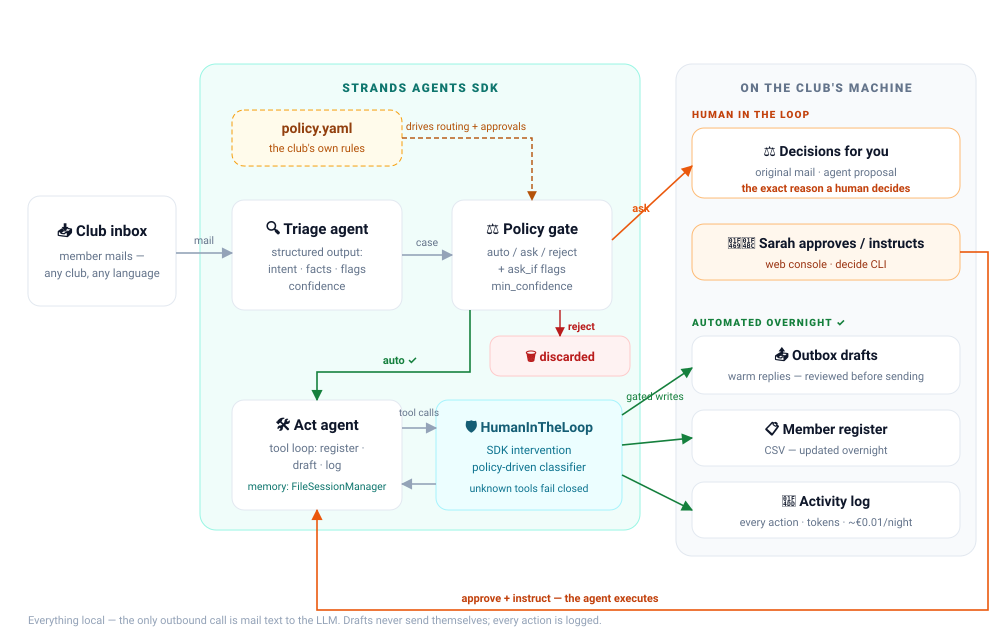
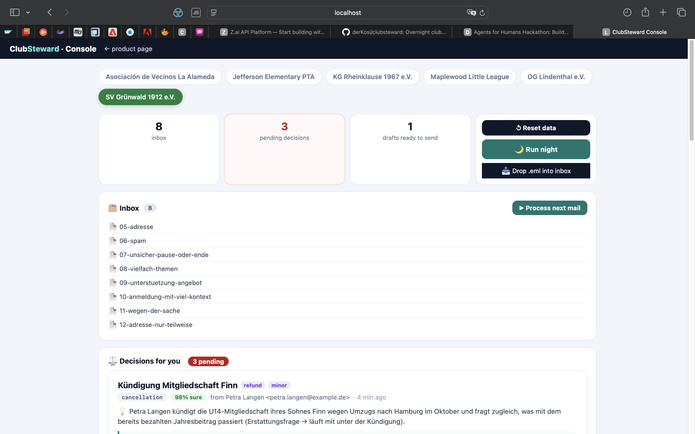
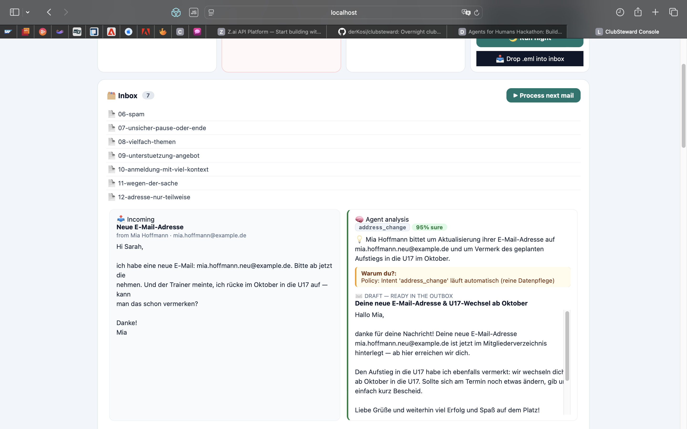
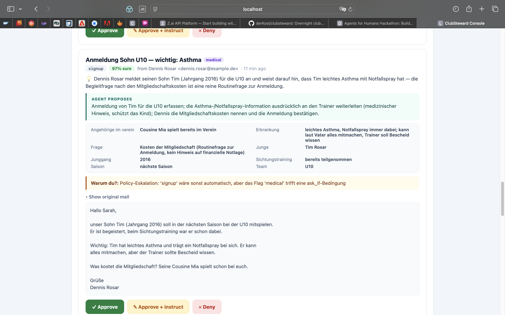
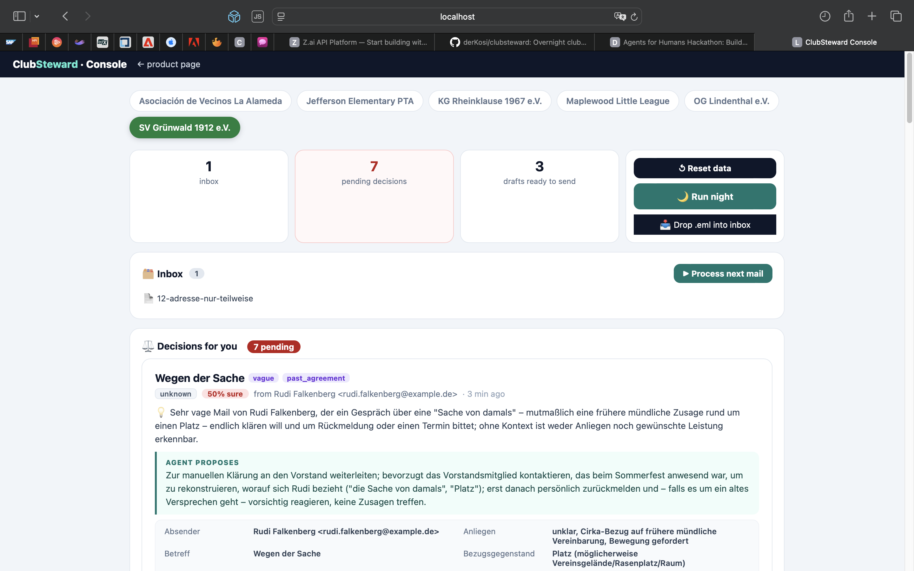

# ClubSteward

**The club-secretary agent that runs your volunteer club's inbox overnight — and only wakes you for decisions that deserve a human.**

Entry for the [Agents for Humans Hackathon](https://agentsforhumans.devpost.com/) (AWS × Devpost, 2026) · Track: **Good Neighbor Agents**
Built with the [Strands Agents SDK](https://strandsagents.com/), powered by GLM (Z.ai) via LiteLLM.

---

## The problem

Community sports clubs, PTAs, scout troops and neighborhood leagues run on a handful of
burned-out volunteers. The club secretary spends hours every week on member emails:
sign-ups, address changes, cancellations, fee questions, hardship requests. Almost all of
it is repetitive — but some of it (a single parent asking for a fee waiver) deserves real
human warmth and judgment.

## What ClubSteward does


*(Recorded replay of a real session — live runs need a Z.ai API key, see Quickstart.)*

Overnight, unattended:

1. **Triages** every mail in the club inbox (structured extraction, no guessing)
2. **Updates the member register** (CSV) — new members, address/email changes, team moves
3. **Drafts warm, on-brand replies** into the outbox (nothing is ever sent automatically)
4. **Queues only real judgment calls** for the secretary: hardship waivers, mid-season
   cancellations, complaints
5. **Discards spam** silently
6. **Logs every action** with its reasoning (full audit trail)

The secretary's morning: an empty inbox, an updated register, 8 polished drafts —
and 2–3 decision cards that take seconds each.

## The policy is data, not code

The club's rules live in [`demo/corpus/policy.yaml`](demo/corpus/policy.yaml):

```yaml
rules:
  - intent: signup            # complete signups are routine
    decision: auto
  - intent: hardship_waiver   # money + empathy = human decides
    decision: ask
  - intent: spam
    decision: reject
min_confidence: 0.75          # below this the agent asks instead of guessing
```

Volunteers edit YAML, not Python. And this file isn't just documentation — it literally
*is* the runtime classifier of the SDK's Human-in-the-Loop intervention (see below).

## Architecture



**Human-in-the-loop, the Strands way:** the Act agent runs with the SDK's
[`HumanInTheLoop`](https://strandsagents.com/docs/user-guide/concepts/agents/interventions/human-in-the-loop/)
intervention. Our custom classifier reads the case context (intent + autonomy) from the
agent state and the club's policy: read-only tools always run free, writes run free only
when the policy says `auto` or a human has approved the case — otherwise the tool call
is escalated. Fail-closed for unknown tools.

**Member memory:** each member gets a persistent agent session
(`FileSessionManager`, `demo/data/sessions/`). When Kwame's mother writes again a week
later, the agent remembers the instalment plan it proposed and answers consistently —
try mail 09 in the corpus.

**Run transparency:** every run writes `demo/data/run_summary.json` — mails, routes,
tokens, latency, tool calls per step, and a cost estimate (~€0.01–0.03 per night for a
small club on GLM-class models). Volunteers can see exactly what the agent did, how long
it took, and what it cost.

## Quickstart

```bash
git clone <repo-url> && cd clubsteward
uv sync
cp .env.example .env          # add your Z.ai API key (https://z.ai)
export $(grep -v '^#' .env | xargs)

# the console — pick a club, step through mails, approve decisions
uv run uvicorn clubsteward.web:app --port 8765    # → http://localhost:8765

# prefer the terminal? the same flow headless:
uv run python scripts/reset_demo.py     # pristine demo corpus
uv run python -m clubsteward.pipeline   # nightly batch run
uv run python -m clubsteward.decide     # work the decision queue
```

**No API key? Watch the recorded session instead:**

```bash
uv sync && uv run python scripts/reset_demo.py
uv run python -m clubsteward.replay      # replays a real recorded run, clearly labeled
```

The replay prints the recorded transcript step by step and reproduces every artifact
(drafts, register updates, decision queue) — marked `[RECORDED SESSION]` so it's never
mistaken for a live call.

Results appear in `demo/data/`: `outbox/` (drafts), `register.csv` (updated),
`decisions/` (cleared), `activity.log` (audit trail).

No cloud, no accounts, no network beyond the LLM API call. Everything else is local files.

## The web console — the secretary's morning

The fastest way to see ClubSteward work is the built-in console — no CLI required:

```bash
uv run uvicorn clubsteward.web:app --port 8765    # open http://localhost:8765
```

Pick any of the six clubs, then:

- **↺ Reset data** — restore the club's starting corpus. Nothing is processed yet;
  processing is always an explicit second step (**🌙 Run night** or **▶ Process next mail**).
- **▶ Process next mail** — step mode: the mail on the left, the agent's live analysis on
  the right — intent, confidence, extracted facts, the policy reason, and the draft it
  produced. The best seat in the house for the escalation moment: a routine sign-up stops
  for a human because one line of YAML says medical notes need a coach.
- **⚖️ Decisions for you** — every judgment call as a card: what the mail said, what the
  agent proposes, and exactly why it's asking (*"Warum du?"* — in the club's own language).
  Approve, approve with an instruction, or deny — the agent executes immediately.
- **🌙 Run night** — the full overnight batch, one click. Need to leave? **⏹ Stop** halts
  after the current mail; the rest simply wait in the inbox.
- **📤 Outbox drafts** — every draft side-by-side with the mail it answers. Nothing is
  ever sent automatically.






## Decisions the agent asks about (examples from the demo corpus)

| Mail | Intent | Why it needs a human |
|---|---|---|
| "Hard times — can the fee be waived?" (single mother, reduced hours) | hardship_waiver | Money + empathy — policy says always ask |
| "Cancelling Noah's membership" (mid-season, fees paid) | cancellation | Team planning + refund judgment |
| "Third cancelled training in a row!" (angry neighbour) | complaint | Conflicts need a human touch |
| "Signing up Yusuf — asthma, carries an inhaler" | signup **+ flag `medical`** | Normally auto, but the policy's `ask_if` condition ("medical notes that require coach coordination") escalates it |
| "We'd like to give something back — sponsorship, jersey deal, repair café" | offer | Inbound money/generosity is decided by humans — no policy rule needed, unknown intents fail closed to ask |

And things it never asks about: plain sign-ups, address changes, fixture questions —
and it silently discards the "YOU WON 5000 EUR" spam.

This escalation engine is data: the triage agent extracts lowercase flags
(`medical`, `waiting_list`, `refund`, ...), and the policy's `ask_if` lines decide
which flags interrupt a human. And when the agent simply isn't sure — a mail it
could only classify at 62% — the policy's `min_confidence` line makes it ask
rather than guess. Volunteers tune autonomy by editing YAML.

## Multiple clubs, white-labeled

ClubSteward is multi-club by design — six example clubs ship in `clubs/`
(three German, two American English, one Spanish):

```bash
uv run python -m clubsteward.club list                    # KG Rheinklause · SV Grünwald · OG Lindenthal
uv run python -m clubsteward.club run kg-rheinklause      # nightly run for the Karnevalsverein (German mails!)
uv run python -m clubsteward.club decide kg-rheinklause   # decision queue, German policy reasons
uv run python -m clubsteward.club status kg-rheinklause   # branded overview
```

Each club is a folder: `policy.yaml` (rules + fees + tone + signature), `brand.yaml`
(name, tagline, colors, locale), `corpus/` (sample mails + register). The agent replies
in the member's language (German clubs → German drafts), signs with the club's own
signature, and never invents fees — amounts come from the policy file.

Create your own club in one command:

```bash
uv run python -m clubsteward.club new mein-verein --name "Mein Verein e.V." \
    --tagline "Gemeinsam stark" --color "#15803d"
```

## Data handling: what stays on the machine

Trust here is a mechanism, not a promise:

- **Local by construction** — mails, member register, decision queues, drafts and
  session transcripts live in the club's own folder. No cloud storage, no telemetry,
  and no outbound email: replies are *drafts* that a human reviews and sends.
- **The one thing that leaves the machine** — mail *text* is sent to the LLM API
  for triage and drafting. That is the entire data boundary, and it is the same
  boundary as "a volunteer pastes an email into a chatbot" — except everything
  else stays local and every action is logged.
- **Bring your own endpoint** — `ZAI_BASE_URL` / `ZAI_MODEL` accept any
  OpenAI-compatible endpoint, including a self-hosted model. Point them at a
  club-local server and mail text never leaves the club's machine at all.
- **Bring your own key** — in the shipped (local) deployment each club runs with
  its own API key. There is no shared platform and no key proxied through us.
- **Right to erasure & export** — deleting a member row plus their session folder
  erases that person; a club folder zips into a full export.

## Design decisions

- **Local files, not integrations.** A club secretary can't set up OAuth. Folders in,
  folders out. (Also: no login-walled scraping, per hackathon rules.)
- **Drafts, never sends.** The outbox is a folder. The human stays in control of actual sending.
- **Fail-closed everywhere.** Unknown intent → ask. Unknown tool → approval required.
  Lookup before write. Agent observed asking members for missing data instead of inventing it.
- **Policy-as-data.** The same YAML powers routing (auto/ask/reject), the HITL classifier,
  and the tone of drafted replies.

## Repo layout

```
clubsteward/          the agent package
  agents.py          triage + act agents (Strands)
  interventions.py   policy-driven HumanInTheLoop classifier
  pipeline.py        overnight batch run
  decide.py          human decision CLI
  tools.py           register/draft/log tools (sandboxed)
  policy.py          policy-as-data loader
  web.py             FastAPI app serving the console + JSON API
webapp/static/       the console UI (vanilla HTML/JS — no build step)
demo/corpus/         pristine demo corpus (8 mails, register, policy)
demo/data/           runtime sandbox (gitignored contents, reset via script)
scripts/             reset_demo, run helpers
tests/               unit tests (policy, classifier, parsing — no LLM)
```

## License

MIT — see [LICENSE](LICENSE).
